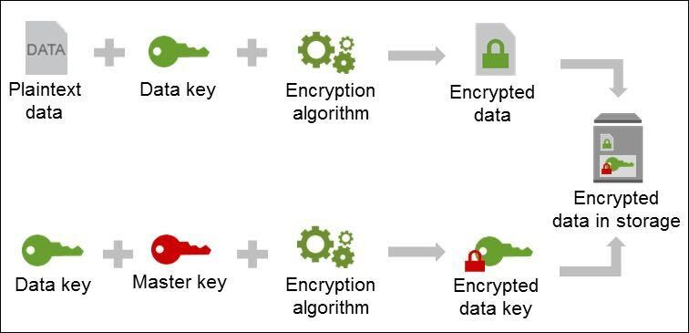

# KeyGenerate.ts


A script for generating, managing, and securely storing keys using Bitwarden.



## Overview

This script automates the process of:
1. Generating cryptographic keys
2. Encrypting the keys using AWS KMS (Key Management Service)
3. Securely storing the encrypted keys in Bitwarden

## Prerequisites

- Node.js
- yarn
- Bitwarden CLI

## Installation

1. Install dependencies:
   ```
   yarn
   ```

2. Install Bitwarden CLI:
   ```
   npm install -g @bitwarden/cli
   ```

## Configuration

Edit the `run_key_generate.sh` file and set the following environment variables:

- BW_SESSION
- AWS_REGION
- KMS_KEY_ARN
- SECRET_ARN
- BITWARDEN_COLLECTION_NAME
- BITWARDEN_ITEM_NAME
- BW_SERVER

## Usage

Run the script:
```
./run_key_generate.sh
```

This will:
1. Generate a new key
2. Encrypt the key using AWS KMS
3. Upload the encrypted key to Bitwarden


## Ubuntu Environment Setup

If you're using Ubuntu, follow these steps:

1. Create an `ubuntu_setup.sh` file:

```bash
#!/bin/bash
sudo apt update
sudo apt install npm
sudo npm install -g yarn
sudo npm install -g @bitwarden/cli

echo "export PATH=\"$PATH:/usr/local/bin\"" >> ~/.bashrc
source ~/.bashrc
```

2. Add execution permissions:

```
chmod +x ubuntu_setup.sh
```

3. Run the script:

```
./ubuntu_setup.sh
```
